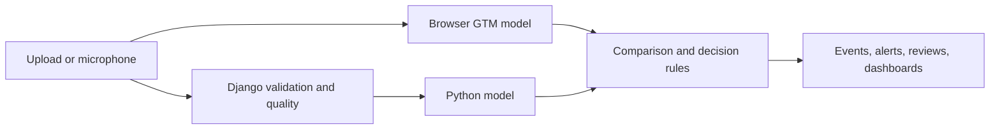

# SonicSentinel AI

SonicSentinel AI is a Django application for analyzing uploaded recordings and live microphone audio. A saved Python classifier and an independently trained Google Teachable Machine (GTM) model score sound events. The application compares their results, checks audio quality, applies category-specific alert rules, and retains events for human review and reporting. It is a **competition prototype for controlled testing**, not a certified emergency-response or law-enforcement system.

This is the full project repository for the [SonicSentinel AI SRS](SonicSentinel%20AI-NextWave%20AI%20and%20ML_SRS.pdf). It contains the web app, data preparation and model-training code, saved Python and GTM models, tests, configuration, dataset metadata, evaluation evidence, and the [project report](documentation/project_report.md). The complete raw and built dataset is not in this checkout; see [Dataset and evidence](#dataset-and-evidence).

**Team:** Saeed Ahmed, Manahil Khan, Muhammad Kaif, and Sahil Karim Lakahni. See [CONTRIBUTORS.md](CONTRIBUTORS.md) and the [contribution record](documentation/team_contributions.md).

## Contents

- [Features and scope](#features-and-scope)
- [Models and current results](#models-and-current-results)
- [Project layout](#project-layout)
- [Prerequisites](#prerequisites)
- [Install locally](#install-locally)
- [Use the application](#use-the-application)
- [Dataset and evidence](#dataset-and-evidence)
- [Tests and data pipeline](#tests-and-data-pipeline)
- [Troubleshooting](#troubleshooting)

## Features and scope

The ten mandatory SRS sound classes are Machinery Fault, Glass Breaking, Alarm or Siren, Vehicle Horn, Animal Sound, Gunshot, Panic Scream, Aggression, Person Asking for Help, and Background Noise. The project also includes the optional Normal Machinery class to distinguish a working machine from a fault.

- Upload and authorized batch upload of WAV, MP3, FLAC, OGG, and M4A files; browser playback and seeking.
- Live microphone monitoring with explicit Start, Pause, and Stop controls, status display, and short prediction windows.
- Independent Python and GTM class scores, confidence comparison, waveform, spectrogram, quality grade, uncertainty, and overlap indicators.
- Configurable alert thresholds and category rules, alert handling, manual review with preserved model outputs, event history, analytics, PDF event reports, and CSV/XLSX export.
- Five roles: normal user, audio reviewer, security operator, maintenance operator, and administrator.



## Models and current results

The selected Python model is `ensemble-20260928-1`, combining saved YAMNet and CNN models. Its recorded 11-class test accuracy is **87.6%** and macro F1 is **0.877**. Aggression recall is **80%**, below the SRS 85% critical-class target. The [current Python comparison](reports/comparison.md) covers SVM, XGBoost, YAMNet, CNN, and the ensemble, including confusion matrices and robustness tests.

The saved GTM export has **ten labels** and does not include Person Asking for Help. The [older common-test comparison](reports/model_comparison.md) used an earlier ten-class Python model and reports 86.4% Python accuracy and 55.5% GTM accuracy across 450 test recordings. These are separate model versions; a current 11-class GTM comparison remains outstanding. The [project report](documentation/project_report.md) explains the methods, results, and limitations.

## Project layout

| Path | Contents |
|---|---|
| [`src/sonic/`](src/sonic/) | Dataset, quality, preprocessing, features, augmentation, training, detection, inference, and Django application code. |
| [`templates/`](templates/) and [`static/`](static/) | Web pages and JavaScript, including browser GTM inference. |
| [`config/`](config/) and [`alert_rules/`](alert_rules/) | Sound classes, processing settings, and default decision rules. |
| [`python_models/`](python_models/) and [`gtm_model/`](gtm_model/) | Saved classifier artifacts and the GTM TensorFlow.js export. |
| [`data/metadata/`](data/metadata/) | Dataset IDs, split, source/license records, quality, and statistics. |
| [`reports/`](reports/) | Training, tuning, comparison, confusion, and robustness evidence. |
| [`tests/`](tests/) | Automated tests. |
| [`documentation/`](documentation/) | Project report, development log, data dictionary, and pipeline guides. |
| [`documentation/technical_blog.html`](documentation/technical_blog.html) | Standalone technical blog covering the SRS topics, results, and lessons learned. |
| [`documentation/technical_blog_blogger.html`](documentation/technical_blog_blogger.html) | Paste-ready version for Blogger's HTML post editor; see the [publishing instructions](documentation/blogger_publishing.md). |
| [`sample_audio/`](sample_audio/) | A small CC0 demo subset with provenance; not the full dataset. |

The project uses **uv for Python project management**. Dependencies are declared in [`pyproject.toml`](pyproject.toml), pinned in [`uv.lock`](uv.lock), and the intended Python version is in [`.python-version`](.python-version). Use `uv sync` to create `.venv` and `uv run` for project commands; manual activation is optional. The SRS-requested [`requirements.txt`](requirements.txt) is a compatibility pointer to the project, while `uv.lock` is the reproducible environment specification.

## Prerequisites

- A 64-bit Windows development machine. This checkout has been developed on Windows; other operating systems have not been verified for the full audio and TensorFlow workflow.
- [uv](https://docs.astral.sh/uv/getting-started/installation/) on `PATH`. Run `uv --version` to check it. uv can obtain the Python version selected by `.python-version` when needed.
- Enough free space for Python dependencies and saved model files. The optional raw and built audio dataset requires substantially more space and can live on another drive.
- [FFmpeg](https://ffmpeg.org/download.html) on `PATH` if you need to upload M4A files. WAV, MP3, FLAC, and OGG use the installed audio decoder. Run `ffmpeg -version` to check it.
- A modern browser with microphone support for live monitoring. The current frontend loads Tailwind CSS and GTM's TensorFlow.js libraries from jsDelivr, so those pages need network access to that CDN.
- Network access on the first Python analysis or training run so the app can download the frozen [YAMNet backbone](https://tfhub.dev/google/yamnet/1). It caches that model under `<SONIC_DATA_DIR>/model_cache/yamnet-1` for later runs.

The project requires Python **3.11.9 or newer**. `.python-version` selects 3.11.9 for uv. The saved Python model files are in [`python_models/`](python_models/) and the exported GTM files are in [`gtm_model/`](gtm_model/); keep both directories beside the application code.

## Install locally

Run these commands from the repository root, where `pyproject.toml` and `manage.py` are located. In PowerShell:

```powershell
uv sync --locked
Copy-Item .env.example .env
New-Item -ItemType Directory -Force database
uv run python manage.py migrate
uv run python manage.py check
```

`uv sync --locked` creates or updates `.venv` from the committed lockfile without changing the lockfile. The development and test dependencies are included by default. On a Unix shell, use `cp .env.example .env` and `mkdir -p database` in place of the two PowerShell filesystem commands; the `uv` and Django commands are the same. The full application has only been verified on Windows.

Edit `.env` after copying it. `SONIC_DATA_DIR` is blank in the example, so the app defaults to this repository's `data/` directory. Set it to an existing directory on another drive if you keep large datasets there. Configuration values are read from the process environment first, then `.env`, then defaults. Keep `.env` private; it is listed in `.gitignore`.

| Setting | Local purpose |
|---|---|
| `SONIC_DATA_DIR` | Raw and built audio dataset location; defaults to `data/`. |
| `SONIC_UPLOAD_DIR` | Uploaded audio location; defaults to `<SONIC_DATA_DIR>/web_uploads`. |
| `SONIC_DEBUG` | Use `1` for local development. Set `0` only with production settings and a secret key. |
| `SONIC_SECRET_KEY` | Required when `SONIC_DEBUG=0`. |
| `SONIC_ALLOWED_HOSTS` | Host names Django may serve; example allows localhost. |
| `SONIC_DEMO_PASSWORD` | Password for optional demo accounts; at least eight characters. |
| `FREESOUND_API_KEY` | Only needed to collect Freesound dataset clips. |

For local administrator access, choose either option:

```powershell
uv run python manage.py createsuperuser
```

Or set `SONIC_DEMO_PASSWORD` in `.env` and create one account for each app role:

```powershell
uv run python manage.py seed_users
```

The seed command creates usernames `admin`, `reviewer`, `security`, `maintenance`, and `user` with the password you supplied. It does not reset an existing account's password unless you explicitly pass `--reset`. Do not publish evaluator passwords in this repository.

Start the local development server:

```powershell
uv run python manage.py runserver
```

Open `http://127.0.0.1:8000/`. You can register a normal account or sign in with an account created above. `runserver` is for local development; it is not a production deployment command.

## Use the application

1. **Upload audio:** Open **Analyse audio**, choose a WAV, MP3, FLAC, OGG, or M4A file, and press **Analyse**. The page previews the selected file. Authorized operator roles can select several files for batch analysis. File size and other limits are shown in the page and can be changed by an administrator.
2. **Inspect a result:** Open the event page to play or seek through the audio; view its filename, format, duration, sample rate, quality, waveform, and spectrogram; and compare the Python and GTM top predictions and class scores. The page also shows model agreement, confidence difference, severity, alert status, and reasons for manual review. A low score or small margin means the model is uncertain, not that the sound is safe.
3. **Monitor live sound:** Open **Live monitoring**, choose an input device, press **Start**, and allow the browser's microphone request. The page shows microphone status, current class, both model results, agreement, waveform, spectrogram, and any active alert. Use **Pause** or **Stop** when finished. Recording begins only after Start.
4. **Review events and alerts:** The **History** page supports search and filters. Reviewers and administrators can listen, confirm or correct a class, add comments, and close or reopen reviews. Security, maintenance, and administrators can handle alerts according to their role. Original model scores remain stored after a human correction.
5. **View dashboards and reports:** The dashboard shows recent activity; authorized roles can open analytics. An event page offers a PDF analysis report. Administrators can export event records in CSV or Excel format and manage confidence thresholds, alert rules, retention, users, and the audit trail.

The current Python ensemble includes all 11 registry labels. The saved GTM export contains ten and **does not include Person Asking for Help**. Events with unavailable GTM evidence can be routed to manual review; see the [report's limitations](documentation/project_report.md#limitations).

## Dataset and evidence

The recorded dataset has **3,347 unique original clips** across the ten mandatory classes and Normal Machinery, with 2,343 train, 502 validation, and 502 test clips. Its metadata and counts are in [`data/metadata/`](data/metadata/). The complete audio dataset is stored outside this source checkout and is not recreated by installing dependencies. The [dataset guide](documentation/dataset.md) explains ethical sourcing, collection, group-aware splitting, and rebuilding. The [sample audio](sample_audio/) folder contains only a limited set of clips whose metadata records CC0 licensing; other classes need source-specific permission or attribution before public redistribution.

The [development log](documentation/development_log.md), [AI usage declaration](AI_USAGE.md), [model evidence](reports/comparison.md), [project report](documentation/project_report.md), and [technical blog](documentation/technical_blog.html) describe the work and its limitations. A [Blogger-ready HTML copy](documentation/technical_blog_blogger.html) is available for the post editor. This checkout did not contain its earlier Git history, so the documented competition-day work cannot be reconstructed as historical Git commits. A deployment URL and demo video have not been supplied in this repository.

## Tests and data pipeline

Run the automated suite from the repository root:

```powershell
uv run pytest
```

For the dataset, preprocessing, augmentation, feature extraction, GTM sample preparation, model training, and evaluation commands, follow the focused guides in [`documentation/`](documentation/) and the saved evidence in [`reports/`](reports/). The source checkout contains dataset metadata, while raw and built audio may be stored separately under `SONIC_DATA_DIR`; those large files are not installed by `uv sync`. Do not use validation or test recordings to train either model.

## Troubleshooting

- **`uv` is not recognized:** Install uv from its [official installation guide](https://docs.astral.sh/uv/getting-started/installation/), reopen the terminal, then run `uv --version`.
- **Database error during migration:** Confirm the `database/` directory exists and is writable, then rerun `uv run python manage.py migrate`.
- **The configured data path does not exist:** Set `SONIC_DATA_DIR` in `.env` to a directory available on this machine, or clear it to use the repository default.
- **M4A cannot be decoded:** Install FFmpeg and confirm `ffmpeg -version` works in the same terminal that starts Django.
- **Microphone is unavailable or permission is denied:** Use a supported browser on localhost, allow microphone access, select an input device, and retry Start. The page displays the microphone state.
- **GTM is unavailable:** Confirm `gtm_model/model.json`, `weights.bin`, and `metadata.json` exist and the browser can reach the TensorFlow.js scripts loaded by the page. A missing GTM result is shown as such and sent through the uncertainty/review path.
- **The first analysis is slow:** Loading TensorFlow and the saved Python model can take longer than later requests. The measured model timing in the report excludes that one-time load.
- **YAMNet cannot download:** Check access to TensorFlow Hub on the first Python inference. Once downloaded, the cached backbone is reused from `<SONIC_DATA_DIR>/model_cache/yamnet-1`.

The [development log](documentation/development_log.md), [AI usage declaration](AI_USAGE.md), and [project report](documentation/project_report.md) provide additional project evidence.
