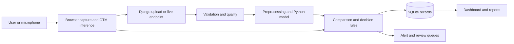
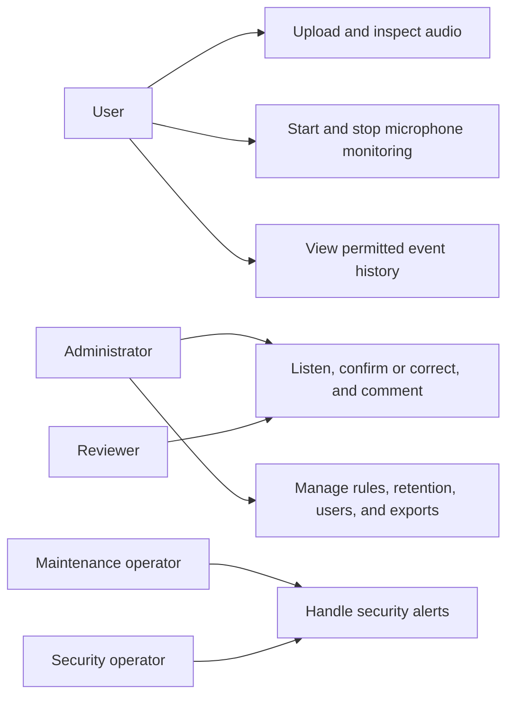
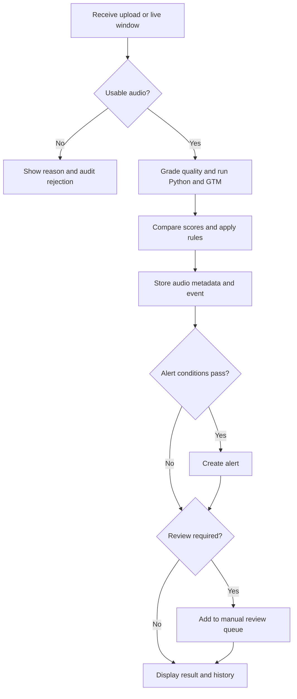
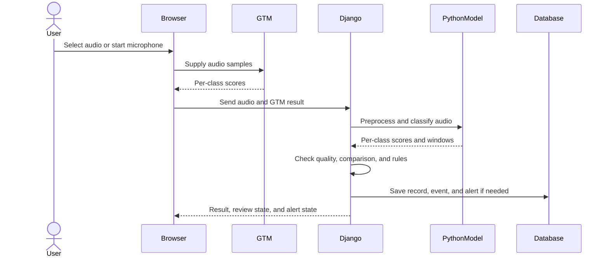
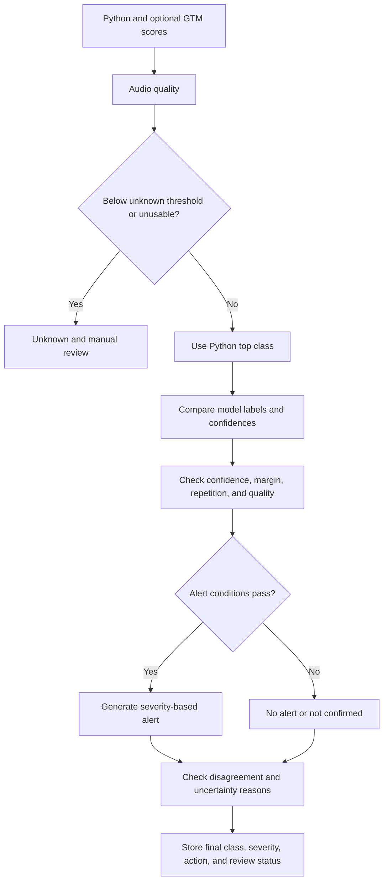

# SonicSentinel AI Project Report

**Project:** SonicSentinel AI  
**Theme:** AcousticX Intelligence  
**Category:** NextWave AI and ML  
**Team members:** Saeed Ahmed, Manahil Khan, Muhammad Kaif, Sahil Karim Lakahni  
**Report date:** 29 September 2026

This report describes the application represented by the repository at the report date. It follows the **Project Report** headings in Section 1.10 of the [SonicSentinel SRS](../SonicSentinel%20AI-NextWave%20AI%20and%20ML_SRS.pdf). The repository contains a current 11-class Python model and an earlier 10-class GTM export. Their results are identified by version throughout; the older cross-model comparison does not establish performance for Person Asking for Help.

## Table of Contents

1. [Problem Definition](#problem-definition)
2. [Background and Business Necessity](#background-and-business-necessity)
3. [Proposed Solution](#proposed-solution)
4. [Purpose](#purpose)
5. [Scope](#scope)
6. [Assumptions](#assumptions)
7. [Constraints](#constraints)
8. [Functional Requirements](#functional-requirements)
9. [Non-Functional Requirements](#non-functional-requirements)
10. [Application Architecture](#application-architecture)
11. [Module Descriptions](#module-descriptions)
12. [Database Design](#database-design)
13. [Data Dictionary](#data-dictionary)
14. [Data Flow Diagram](#data-flow-diagram)
15. [Use Case Diagram](#use-case-diagram)
16. [Activity Diagram](#activity-diagram)
17. [Sequence Diagram](#sequence-diagram)
18. [Decision Flow Diagram](#decision-flow-diagram)
19. [Audio-Processing Pipeline](#audio-processing-pipeline)
20. [Critical-Event Rule Design](#critical-event-rule-design)
21. [Python Model Design](#python-model-design)
22. [GTM Model Design](#gtm-model-design)
23. [Dataset Description](#dataset-description)
24. [Dataset-Collection Method](#dataset-collection-method)
25. [Data Augmentation](#data-augmentation)
26. [Audio Preprocessing](#audio-preprocessing)
27. [Feature Extraction](#feature-extraction)
28. [Python Model Training](#python-model-training)
29. [GTM Model Training](#gtm-model-training)
30. [Model Evaluation](#model-evaluation)
31. [Confusion Matrices](#confusion-matrices)
32. [Accuracy, Precision, Recall, and F1-score](#accuracy-precision-recall-and-f1-score)
33. [Model Prediction Comparison](#model-prediction-comparison)
34. [Confidence Comparison](#confidence-comparison)
35. [Noise-Robustness Analysis](#noise-robustness-analysis)
36. [False-Positive Analysis](#false-positive-analysis)
37. [False-Negative Analysis](#false-negative-analysis)
38. [Testing Strategy](#testing-strategy)
39. [Security](#security)
40. [Privacy](#privacy)
41. [Limitations](#limitations)
42. [Future Enhancements](#future-enhancements)
43. [Evidence and References](#evidence-and-references)

## Problem Definition

People cannot continuously listen to every microphone or recording in a plant, building, or public area. A significant sound can be missed or recognized too late, while ordinary noise can trigger unnecessary action. The project addresses this by classifying uploaded and live audio, preserving the evidence behind each result, and giving uncertain or serious detections a clear review or alert path. It is a competition prototype for controlled testing, as stated in the application's footer, rather than a certified emergency-response system.

## Background and Business Necessity

The SRS identifies machinery faults, broken glass, alarms, vehicle horns, animal sounds, gunshots, panic screams, aggression, calls for help, and background noise as the mandatory categories. These sounds can have different operational consequences: a possible fault calls for maintenance, while a possible gunshot calls for urgent human assessment. Acoustic conditions vary by device, distance, noise, echo, and overlapping events. The application therefore records model confidence, quality, and disagreement alongside the predicted category, so an operator can judge the evidence instead of seeing only a label.

## Proposed Solution

SonicSentinel is a Django web application with upload and browser-microphone workflows. Python processes audio and runs a locally saved classifier. A separately trained Google Teachable Machine (GTM) model runs in the browser with TensorFlow.js on the same audio input. The server compares their outputs and applies configurable rules to determine severity, alerts, and manual review. Events, model versions, audio metadata, actions, and audit records are stored in SQLite. Dashboards, search, PDF reports, and CSV/XLSX export expose the results.

## Purpose

The application is intended to help users identify and inspect sound events, and to help reviewers and operators act on uncertain or critical detections. This report explains the implemented design, available evaluation evidence, and current gaps for reviewers and team members who must be able to explain the code.

## Scope

The repository covers data collection and preparation, Python model training and evaluation, GTM export and browser inference, upload analysis, live microphone monitoring, quality checks, rule-based decisions, alerts, manual review, event history, analytics, and reports. The class registry includes ten mandatory classes plus the optional **Normal Machinery** class. The selected Python ensemble has all 11 classes. The saved GTM export has ten labels and omits Person Asking for Help; the application handles an unavailable GTM result through the review path.

## Assumptions

The web app assumes that users have permission to record or upload audio, that the browser supports microphone access and audio decoding, and that the saved model files match the application's class names. Dataset source labels and licenses are taken from the recorded metadata. Unknown recording environments, devices, and distances remain unknown rather than being inferred. Operators must verify an event before treating the prototype as evidence for a real-world response.

## Constraints

Audio quality, background interference, source distance, device characteristics, and class overlap limit accuracy. Some classes are concentrated in specific source datasets, creating a shortcut risk. The GTM model has fewer training samples and lower recorded accuracy than the Python ensemble. The saved GTM export predates the Help class, so the two current models do not yet share the full SRS label set. Dataset size and TensorFlow inference also require storage and compute beyond a small source checkout.

## Functional Requirements

Section 1.6 of the SRS defines 80 functional requirements. The web code implements five user roles with capability checks; registration and profiles; single and authorized batch upload; browser microphone sessions; file validation; playback; metadata, waveform, and spectrogram display; independent model scores; rule-based alerts; reviews and overrides; dashboards, history, filters, analytics, reports, export, audit logging, duplicate detection, anomaly notices, and configurable retention. The data pipeline implements grouped splits, quality checks, preprocessing, augmentation, features, training, and model comparison. The material functional gap is the GTM model's missing Person Asking for Help label, which prevents full 11-class comparison. See [roles](../src/sonic/web/accounts/roles.py), [upload pipeline](../src/sonic/web/events/pipeline.py), [live pipeline](../src/sonic/web/events/live.py), and [decision logic](../src/sonic/detection/decision.py).

## Non-Functional Requirements

The SRS sets targets of 8 seconds for a 30-second upload, 3 seconds for a live-window prediction, 20,000 event records, 99% availability, 85% accuracy, 0.80 macro F1, and 85% recall on five critical classes for **both** models. The saved Python evaluation reports 0.787 seconds for a 30-second upload after model loading, 87.6% accuracy, and 0.877 macro F1. Its Aggression recall is 80%, below target. The older GTM comparison reports 55.5% accuracy and 0.555 macro F1 on a ten-class test, below target. The repository does not contain evidence establishing the 20,000-record, concurrent-user, or 99% uptime targets. These performance figures are measured evaluation results, not a deployment service guarantee. Source: [current comparison](../reports/comparison.md), [earlier dual-model comparison](../reports/model_comparison.md).

## Application Architecture

The browser renders Django templates and uses JavaScript for file upload and microphone capture. The GTM TensorFlow.js model runs in the browser; its scores accompany the audio request to the Django backend. Django validates and stores audio, runs the selected Python model, evaluates quality, creates waveform and spectrogram images, applies comparison and alert rules, then persists records. SQLite stores application state, while uploaded audio is kept outside the public static root and served through permission-checked views. Model files are loaded from `python_models/` and `gtm_model/`. The Python project is managed with **uv**: `pyproject.toml` declares dependencies, `uv.lock` pins them, `.python-version` selects Python 3.11.9, and `uv run` executes application and test commands inside the project environment. The [README](../README.md) gives installation and execution steps. See [settings](../src/sonic/web/settings.py), [GTM client](../static/js/gtm.js), and [event pipeline](../src/sonic/web/events/pipeline.py).

## Module Descriptions

| Module | Responsibility |
|---|---|
| `sonic.dataset` | Collect, check, identify, and split original audio; produce metadata. |
| `sonic.quality` | Grade signal and recording quality. |
| `sonic.preprocessing` | Convert audio to standardized one-second windows. |
| `sonic.augmentation` | Transform training windows while preserving their parent Audio ID. |
| `sonic.features` | Produce 123 summary features and log-mel arrays. |
| `sonic.models` | Train, calibrate, evaluate, compare, and select Python models. |
| `sonic.inference` | Load the selected model and infer clip and window probabilities. |
| `sonic.detection` | Compare scores and apply confidence, repetition, overlap, and alert rules. |
| `sonic.web` | Authentication, events, monitoring, alerts, review, analytics, and export. |
| `sonic.gtm` and `static/js/gtm.js` | Prepare GTM training samples and run the exported model in the browser. |

## Database Design

The Django models use SQLite by default. `User` holds role and profile data and receives a `USR` code; `AuditLog` records actions. `MonitoringSession` groups live windows. `AudioRecord` holds file metadata, quality, hashes, duplicate relationships, and an owner. A one-to-one `SoundEvent` holds Python and GTM scores, model versions, comparison, decision, and review fields. `ReviewEntry` preserves reviewer history. `DecisionSettings` and `AlertRule` store administrator settings. `Alert`, `AlertAction`, and `AdminNotice` record alerts, handling history, and anomaly notices. Foreign keys connect each event to its audio record and each alert or review to its event. See [event models](../src/sonic/web/events/models.py), [alert models](../src/sonic/web/alerts/models.py), and [account models](../src/sonic/web/accounts/models.py).

## Data Dictionary

The dataset's [data dictionary](data_dictionary.md) defines `audio_id`, source and split fields, recording and device metadata, license, quality, hashes, and parent IDs. In the app, `AudioRecord.code` is the uploaded/live audio ID; `SoundEvent.code` is the event ID; `python_scores` and `gtm_scores` are class-to-probability JSON maps; `confidence_difference` is the absolute difference between the models' top scores; `reviewed_class` records a human correction without changing original outputs. The event status distinguishes classified, uncertain, alert generated, manual review, reviewed, and closed records.

## Data Flow Diagram

The browser sends GTM scores and audio to the server; the Python prediction is computed independently. The decision stage receives both results after inference. This follows the code in [upload pipeline](../src/sonic/web/events/pipeline.py) and [live pipeline](../src/sonic/web/events/live.py).

## Use Case Diagram

The roles follow the capability matrix in [roles.py](../src/sonic/web/accounts/roles.py). Reviewers and administrators may review; security and maintenance operators may handle alerts; administrators manage system settings.

## Activity Diagram

## Sequence Diagram

## Decision Flow Diagram

The decision uses the Python top class as its candidate because that model performed better in the recorded common-test comparison. GTM agreement affects consistency and review; it is not fed into the GTM model. See [decision.py](../src/sonic/detection/decision.py).

## Audio-Processing Pipeline

For an upload, the server checks extension, size, decodability, duration, sampling rate, channels, integrity, and signal usability. Quality is assessed on the raw audio. The preprocessor converts to mono, resamples to 16 kHz, removes DC offset, trims silence, normalizes level, and creates one-second windows with a 0.5-second hop. Noise reduction exists but is disabled by default because it can damage short events and the Background Noise class. The selected Python model scores windows and aggregates them for a clip result. Waveform and spectrogram PNGs are generated for display. Live input passes through the related window pipeline. See [preprocessing guide](preprocessing.md), [pipeline](../src/sonic/web/events/pipeline.py), and [live pipeline](../src/sonic/web/events/live.py).

## Critical-Event Rule Design

The JSON [alert rule file](../alert_rules/alert_rules.json) seeds database rules, which administrators can edit. Global defaults include minimum confidence 0.50, top-two margin 0.10, overlap threshold 0.25, and Unknown threshold 0.35. A category rule supplies severity, confidence and margin thresholds, repeated-detection count, quality and model-agreement requirements, action, and escalation delay. Gunshot is Critical and requires two detections; Glass Breaking is High; Panic Scream and Person Asking for Help are Critical; Aggression is High and can rise to Critical with stronger repeated evidence. A failed alert condition is recorded as Not confirmed and may require review. Human handlers can acknowledge, dismiss, resolve, or escalate an alert, with each action retained.

## Python Model Design

The project compares four model families and an ensemble: RBF SVM and XGBoost on 123 summary features; a CNN on 64-by-63 log-mel spectrograms; a YAMNet transfer model on one-second waveforms; and a calibrated soft-voting ensemble of YAMNet and CNN probabilities. The selected version is `ensemble-20260928-1`, as recorded in [selected.json](../python_models/selected.json). Window scores are calibrated, then combined into a clip score using the recorded model aggregation settings. The web app loads this selected model for uploads and live windows. See [model code](../src/sonic/models/) and [current evaluation](../reports/comparison.md).

## GTM Model Design

The exported GTM audio model is a separate TensorFlow.js speech-commands model. The browser's [GTM client](../static/js/gtm.js) converts decoded audio to the frequency-frame input expected by the export, maps labels by name, and produces per-class scores without receiving Python predictions. The [saved metadata](../gtm_model/metadata.json) contains ten labels, including optional Normal Machinery, but no Person Asking for Help. This is a version gap between the current Python model and the saved GTM artifact.

## Dataset Description

The [dataset statistics](../data/metadata/dataset_statistics.json) record **3,347 unique original clips**: 300 for each of the ten mandatory classes, 300 Normal Machinery clips, and 47 additional Background Noise clips. The saved split is 2,343 training, 502 validation, and 502 test clips, approximately 70/15/15. The Help class has 300 clips from synthetic speech rather than volunteer recordings, so its measured performance does not prove real emergency-voice performance. The repository holds metadata and statistics; the large audio dataset is configured separately through `SONIC_DATA_DIR`. Augmented segments are tracked separately and are not counted as unique originals.

## Dataset-Collection Method

The builder reads ethically sourced or licensed material from ESC-50, UrbanSound8K, FSD50K, MIMII, RAVDESS, Nonspeech7k, Freesound, custom recordings, and the recorded Help synthesis process. Source paths, license fields, original IDs, hashes, class labels, and split groups are saved per clip. The builder rejects silent, too-short, and conflicting-label files, assigns class-coded IDs, and keeps related clips together in a split. The [dataset guide](dataset.md) documents source selection and import steps; [Help recording notes](help_recordings.md) describe the intended future volunteer collection. The current [statistics](../data/metadata/dataset_statistics.json) report 41 rejected files.

## Data Augmentation

The [augmentation module](../src/sonic/augmentation/) creates copies only from training segments and keeps each copy's original Audio ID and training split. Documented transformations include background-noise mixing, time and pitch shifts, time stretching, gain, reverberation, distance simulation, and microphone-band simulation. This increases training variation and reduces reliance on source-specific backgrounds. The generated rows are recorded in [augmented segment metadata](../data/metadata/augmented_segments.csv). The [augmentation guide](augmentation.md) documents settings and the earlier build; the current model evaluation is the authority for current performance.

## Audio Preprocessing

The [shared preprocessor](../src/sonic/preprocessing/pipeline.py) is used for training and inference with different window-selection modes. The [preprocessing settings](../config/audio.json) specify the target sampling rate and segment length. Training keeps event-bearing windows; inference retains ordered windows and timestamps, skipping silent windows for classification. A shortcut check in [preprocessing evidence](preprocessing.md) shows that normalization reduced, but did not remove, source-format cues. The remaining source bias is a limitation, especially where a class is dominated by one dataset.

## Feature Extraction

The [feature extractor](../src/sonic/features/extract.py) calculates 123 summary values from MFCCs and deltas, chroma, mel bands, zero-crossing rate, RMS energy, spectral centroid, bandwidth, roll-off, contrast, flatness, and onset strength. It also provides a 64-by-63 log-mel spectrogram for the CNN. Tempo is not included because a one-second segment does not support a dependable tempo estimate; the SRS requests it only where relevant. The same extraction code is used in model preparation and web inference. See the [feature guide](features.md).

## Python Model Training

Training uses the common dataset's training recordings and derived training segments. Validation data supports tuning, calibration, aggregation choice, and model selection; the test split is used for final evaluation. The candidate methods include an SVM parameter grid, XGBoost search, transfer-model settings, and CNN training. The selection rule first considers critical-class validation recall, then validation macro F1, mean critical recall, and speed. No candidate met every critical-class recall gate, so the highest-ranked validation model was selected. The selected ensemble combines saved YAMNet and CNN members. The [comparison report](../reports/comparison.md), [tuning files](../reports/tuning/), and [training logs](../reports/) provide the recorded evidence.

## GTM Model Training

The [GTM guide](gtm.md) documents export of one-second samples from the common training recordings, playback through Stereo Mix into Teachable Machine, and a TensorFlow.js export. The documented GTM run used roughly 143-145 samples per class, default settings of 50 epochs and batch size 16, and ten classes. The exported model's timestamp is 27 September 2026. The guide records a training capture issue and a re-recorded Alarm or Siren class. The GTM export has not been retrained with the later Help recordings, and repository evidence does not establish a complete current 11-class GTM training run.

## Model Evaluation

The latest [Python evaluation](../reports/comparison.md) compares five candidates on the test split and reports class-wise F1, critical recall, calibration, simulated robustness, a factory shortcut check, and timing. The selected ensemble reaches 87.6% accuracy and 0.877 macro F1. The [cross-model comparison](../reports/model_comparison.md) is a separate, earlier 450-recording ten-class experiment with `ensemble-20260925-1` and the saved GTM model. It reports Python 86.4% accuracy, GTM 55.5%, and final-decision 85.3%. These experiments should not be merged into one result because their Python versions and class sets differ.

## Confusion Matrices

The [confusion folder](../reports/confusion/) contains validation and test matrices for each Python candidate, including `ensemble-20260928-1_test.png`. Each matrix shows actual classes by row and predicted classes by column, making class-to-class errors visible. The older [dual-model comparison](../reports/model_comparison.md) also prints Python, GTM, and final-decision matrices for its ten-class sample. The current Python matrix is the relevant one for 11-class Python conclusions; a new GTM matrix is needed after GTM retraining.

## Accuracy, Precision, Recall, and F1-score

| Current 11-class Python test model | Accuracy | Macro precision | Macro recall | Macro F1 |
|---|---:|---:|---:|---:|
| SVM | 74.3% | 0.746 | 0.746 | 0.741 |
| XGBoost | 78.7% | 0.787 | 0.789 | 0.784 |
| YAMNet transfer | 80.5% | 0.809 | 0.808 | 0.804 |
| CNN | 84.5% | 0.852 | 0.845 | 0.847 |
| Selected ensemble | **87.6%** | **0.879** | **0.879** | **0.877** |

For the selected ensemble, critical-class test recall is Glass Breaking 91%, Gunshot 93%, Panic Scream 89%, Aggression **80%**, and Person Asking for Help 100%. The Help score comes from synthetic voices. The SRS target of 85% critical recall is missed for Aggression. Figures are from [comparison.md](../reports/comparison.md).

## Model Prediction Comparison

The [earlier comparison report](../reports/model_comparison.md) evaluated 450 unseen clips spanning its ten trained classes; one GTM result was unavailable, so matched-status summaries use 449. The models chose the same class on 262 of those 449 recordings. Among 187 disagreements, Python was right on 150, GTM on 11, and neither on 26. The final-decision class is led by Python, while disagreement can route an event to manual review. This evidence predates the later Help-class Python retraining and cannot support an 11-class dual-model claim.

## Confidence Comparison

For each event the application stores all available class scores, each model's top class and margin, match status, and `abs(Python top confidence - GTM top confidence)`. The earlier cross-model test reports a mean top-confidence difference of 34.4 percentage points. A common class may still be a weak match when its scores differ substantially. Thresholds for low confidence, top-two margin, overlap, and Unknown are configurable in the [alert rules](../alert_rules/alert_rules.json) and [settings models](../src/sonic/web/alerts/models.py). See [comparison logic](../src/sonic/detection/compare.py).

## Noise-Robustness Analysis

The current [Python comparison](../reports/comparison.md) tests noise, echo, low volume, phone-band audio, distant sources, partial clips, and MP3 re-encoding. The selected ensemble's macro F1 falls from **0.877 clean** to **0.840 at 20 dB noise**, **0.735 at 5 dB noise**, and **0.624 at 0 dB noise**. Low volume over simulated microphone hiss produces **0.492**; phone-band audio with clipping produces **0.803**. These are simulated perturbations to the test recordings, not a live deployment trial. The [robustness chart](../reports/robustness.png) contains the comparative view.

## False-Positive Analysis

An early model learned the MIMII factory background as a proxy for Machinery Fault. The team added Normal Machinery as an optional class and retrained. On 60 unseen normal-operation recordings, the current ensemble called **0%** Machinery Fault in the recorded factory shortcut test, compared with 23% for the SVM and 48% for YAMNet. This checks a specific false-alarm path; it does not prove that all real factory sounds are safe from false alerts. The decision engine also requires category-specific confidence, margin, repetition, and quality checks before generating alerts. See [current comparison](../reports/comparison.md) and [decision rules](../src/sonic/detection/decision.py).

## False-Negative Analysis

The selected model's 80% Aggression recall is below the SRS's 85% target, so approximately one in five Aggression clips in the saved test split was missed as that class. Panic Scream reaches 89% recall, but its F1 is 0.82, showing confusion remains. The current model's test recall for Background Noise is not a critical-event metric. Unseen voices and natural Help calls remain an important unknown because the Help test clips are synthesized. Human review and conservative response procedures are needed when the audio or models are uncertain. See [critical recall table](../reports/comparison.md) and [model discussion](models.md).

## Testing Strategy

The repository has pytest modules for dataset construction and splitting, download, recordings, quality, preprocessing, augmentation, features, model inference and evaluation, detection rules, GTM export, comparisons, and web workflows. Web tests cover accounts, upload validation, duplicates, live monitoring, dashboards, alerts, review, search, export, and settings. The comparison reports provide offline model tests on held-out clips and robustness perturbations. This report does not claim a fresh test run or performance certification; the test scripts and saved evidence are available in [tests](../tests/) and [reports](../reports/).

## Security

Django authentication and the [capability matrix](../src/sonic/web/accounts/roles.py) restrict functions by role. CSRF and session middleware are enabled. Uploaded audio lives outside the public static directory and is streamed through permission-checked views. Password validation, secure cookies when `SONIC_DEBUG=0`, and a required secret key in that mode are configured in [settings.py](../src/sonic/web/settings.py). Hashes identify exact duplicates; audio fingerprints support near-duplicate review. [AuditLog](../src/sonic/web/accounts/models.py) retains important user and system actions. These code controls have not been independently penetration-tested in this report.

## Privacy

Microphone capture requires an explicit browser permission and a visible start/stop workflow. Uploaded audio is access-controlled rather than placed in public static assets. Configurable retention can remove older records and stored files. Dataset metadata records source and license; the [Help recording guide](help_recordings.md) describes consent for future volunteer recordings. The present Help dataset uses synthetic speech. A real deployment would still need a documented retention policy, lawful collection basis, and local review of any recordings that identify people.

## Limitations

The saved GTM export omits Person Asking for Help and has lower ten-class accuracy than the SRS target. Aggression recall misses the Python target. The current Help evaluation uses synthetic voices, and some sound classes remain source-concentrated. Preprocessing and augmentation reduce but cannot eliminate dataset bias. Robustness numbers come from simulated conditions. No repository result demonstrates the SRS availability or 20,000-record capacity targets. The prior cross-model comparison uses an older Python model, so it must not be read as current ensemble performance.

## Future Enhancements

Retrain and export GTM with the same 11 labels and common training split as the current Python model, then rerun the unseen test comparison across all mandatory classes. Collect consenting human Help recordings from varied devices and environments, and add diverse Aggression examples to address low recall. Recheck thresholds on validation data after model changes. Run measured concurrent-user, 20,000-record, and uptime tests before claiming those operational targets. Package installation, deployment, and demonstration evidence as separate SRS deliverables.

## Evidence and References

The governing requirements are in the [SRS](../SonicSentinel%20AI-NextWave%20AI%20and%20ML_SRS.pdf), especially Sections 1.6, 1.7, 1.8, and 1.10. Current dataset counts are in [dataset_statistics.json](../data/metadata/dataset_statistics.json); current Python results are in [comparison.md](../reports/comparison.md) and [comparison.json](../reports/comparison.json); the earlier ten-class GTM comparison is in [model_comparison.md](../reports/model_comparison.md) and [model_comparison.csv](../reports/model_comparison.csv). Model identity is recorded in [selected.json](../python_models/selected.json) and [GTM metadata](../gtm_model/metadata.json). The [README](../README.md) documents uv installation and application execution. The [development log](development_log.md) and [AI usage declaration](../AI_USAGE.md) record the development process. Contributor names are provided by the team; individual work allocations are not assigned in this report.
